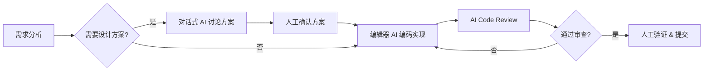

过去半年，我逐渐把 AI 辅助工具融入了日常开发流程。这篇文章不是工具评测，而是记录我在实际项目中踩过的坑、形成的习惯，以及对"AI 到底能帮多少忙"这个问题的阶段性思考。

## 我常用的 AI 编程工具

目前稳定使用的工具主要有三类：

| 类型 | 工具 | 主要场景 |
|------|------|----------|
| 编辑器内联助手 | Claude Code、GitHub Copilot | 日常编码、代码审查、Bug 修复 |
| 对话式助手 | Claude.ai、ChatGPT | 方案设计、代码解释、文档生成 |
| 专用工具 | Cursor、Windsurf | 大型重构、跨文件修改 |

日常开发中，编辑器内联助手的使用频率最高 —— 它在当前文件上下文内做补全和修改几乎无感。对话式助手更适合用在编码前想清楚"该怎么做"的阶段。

## AI 辅助的典型工作流

经过几个项目的摸索，我形成了一个比较固定的流程：

这个流程的核心是 **"AI 提方案，人来拍板"**。AI 擅长快速生成多个可选方案，但在权衡 trade-off 时仍然需要人的判断。比如技术选型时要考虑团队熟悉度、维护成本、生态成熟度 —— 这些背景信息 AI 并不完全掌握。

## 一些有效的使用技巧

### 1. 写好 Prompt 是值得投入的技能

模糊的指令得到模糊的结果。下面是一个对比：

**不好的 Prompt：**
> 帮我写一个登录功能

**更好的 Prompt：**
> 实现一个 Next.js 登录页面，使用 JWT + HttpOnly Cookie。要求：
> - 表单包含邮箱和密码
> - 客户端校验邮箱格式，服务端校验密码强度
> - 登录成功后跳转到 /dashboard
> - 错误时在表单上方显示红色提示

后者给出了技术栈、具体字段、边界行为，AI 一次就能生成接近可用的代码。

### 2. 用 AI 理解陌生代码

接手不熟悉的代码库时，把函数或模块丢给 AI 让它解释，往往比逐行阅读快很多。我常用的提问方式：

- "这个函数的输入输出是什么？有哪些边界情况没处理？"
- "这段代码和项目里哪些模块有耦合？"
- "如果要给这个模块写单元测试，应该覆盖哪些场景？"

### 3. 让 AI 先 Review 自己的代码

提交前让 AI 做一轮 Code Review，检查：
- 潜在的空指针或未处理的异常
- 不符合项目规范的写法
- 可以简化或优化的逻辑

这比直接等到同事 Review 再发现低级错误要高效得多。

## 哪些事不适合交给 AI

踩过一些坑之后，我总结了几个**不要**让 AI 代替的场景：

- **安全相关代码**：加密、认证、权限控制 —— 必须理解每一行的含义，不能盲信 AI 生成的方案
- **关键业务逻辑**：涉及金额计算、数据一致性等，需要完整的领域知识
- **架构决策**：AI 可以列举方案优缺点，但决策依据往往来自项目上下文和组织约束

## 效率提升的真实数据

我做了简单的记录对比：

| 任务类型 | 纯手写 (分钟) | AI 辅助 (分钟) | 提升 |
|----------|:-----------:|:-----------:|:----:|
| 简单 CRUD 接口 | 45 | 15 | 67% |
| 复杂业务逻辑 | 120 | 80 | 33% |
| 编写单元测试 | 60 | 20 | 67% |
| 调试未知 Bug | 90 | 50 | 44% |
| 写技术文档 | 60 | 25 | 58% |

简单重复的工作提效最明显，复杂逻辑的提效幅度较小 —— 因为大量时间花在理解业务而不是写代码上。

## 总结

AI 目前在编程中扮演的是一个**能力放大器**的角色：它让好的开发者更快、让初学者更容易上手，但它不能替代对技术本质的理解。对我来说，最舒服的使用方式不是"让 AI 帮我把活干了"，而是"让 AI 帮我把理解成本降到最低，然后由我来做关键决策"。

接下来我打算继续探索的方向：AI 在自动化测试中的应用、以及如何用 AI 做更好的技术文档维护。
